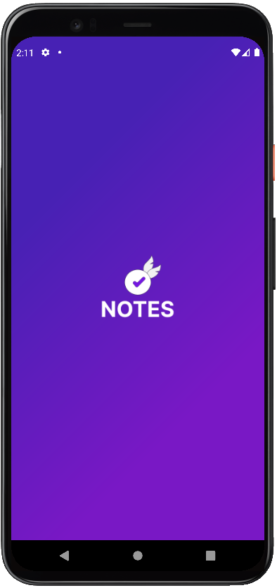
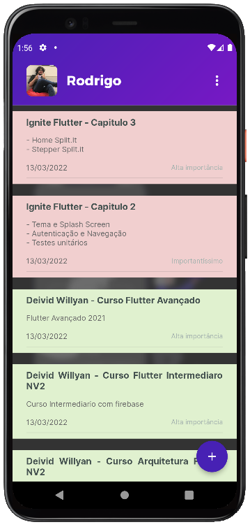
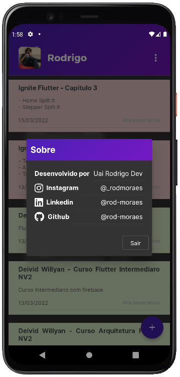
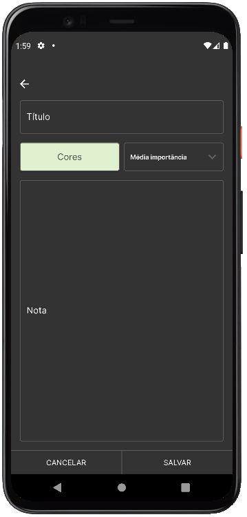

<h1 align="center">
  
  
  
  
</h1>

<h3 align="center">
  Aplicação Flutter para o Notes Ignite
</h3>

<p align="center">A melhor forma para guardar suas anotações!</p>

</br>

Black App:

https://raw.githubusercontent.com/rod-moraes/notes_ignite/main/github/black_app.mp4

White App:

https://raw.githubusercontent.com/rod-moraes/notes_ignite/main/github/white_app.mp4

</p>

<p align="center">
  <a href="#-sobre-o-projeto">Sobre o projeto</a>&nbsp;&nbsp;&nbsp;|&nbsp;&nbsp;&nbsp;
  <a href="#-tecnologias">Tecnologias</a>&nbsp;&nbsp;&nbsp;|&nbsp;&nbsp;&nbsp;
  <a href="#-como-utilizar">Como utilizar?</a>&nbsp;&nbsp;&nbsp;|&nbsp;&nbsp;&nbsp;
  <a href="#-license">Licença</a>
</p>

## 💻 Sobre o projeto

Notes Ignite é uma aplicação desenvolvida para o Desafio 02 - Fluxo de login da Rocketseat, nesse desafio você deveria implementar um fluxo de login no aplicativo de notas feito no capítulo anterior.
Entretanto, para testar meus conhecimentos já existentes junto com conhecimentos da Rocketseat + Flutterando sugeri a mim mesmo fazer o aplicativo desde seu design + programação completa.
O aplicativo se baseia salvar, editar e deletar anotações para cada usuário, sendo possível ter múltiplos usuários em um mesmo celular sem que um afete ao outro.

## 🚀 Tecnologias

Tecnologias utilizadas pra desenvolver o projeto:

- [Flutter](https://flutter.dev/)
- [Dart](https://dart.dev/)

### 💼 Packages utilizados

Os packages utilizados para desenvolver o projeto:

- [localization](https://pub.dev/packages/localization)
- [mobx](https://pub.dev/packages/mobx)
- [flutter_mobx](https://pub.dev/packages/flutter_mobx)
- [mobx_codegen](https://pub.dev/packages/mobx_codegen)
- [build_runner](https://pub.dev/packages/build_runner)
- [google_fonts](https://pub.dev/packages/google_fonts)
- [firebase_core](https://pub.dev/packages/firebase_core)
- [google_sign_in](https://pub.dev/packages/google_sign_in)
- [shared_preferences](https://pub.dev/packages/shared_preferences)
- [sqflite](https://pub.dev/packages/sqflite)
- [http](https://pub.dev/packages/http)
- [intl](https://pub.dev/packages/intl)
- [sizer](https://pub.dev/packages/sizer)
- [package_info_plus](https://pub.dev/packages/package_info_plus)
- [flutter_slidable](https://pub.dev/packages/flutter_slidable)
- [flutter_colorpicker](https://pub.dev/packages/flutter_colorpicker)
- [uuid](https://pub.dev/packages/uuid)
- [share_plus](https://pub.dev/packages/share_plus)
- [font_awesome_flutter](https://pub.dev/packages/font_awesome_flutter)

## 🔥 Como utilizar?

### Requirements

- Você pode seguir com a instalação do Flutter [Flutter tutorial](https://docs.flutter.dev/get-started/install).

**Clone esse projeto e acesse a pasta destino**

```bash
$ git clone https://github.com/rod-moraes/Notes-Ignite.git && cd notes_ignite
```

**Siga os passos abaixo**

```bash
# Instale as dependências
$ flutter run
# Você pode abrir a aplicação no seu Emulador.
```

## 📝 License

This project is licensed under the MIT License - see the [LICENSE](LICENSE) file for details.

---

Feito com 💜 por Rodrigo Moraes para o Desafio 02 - Fluxo de login.
